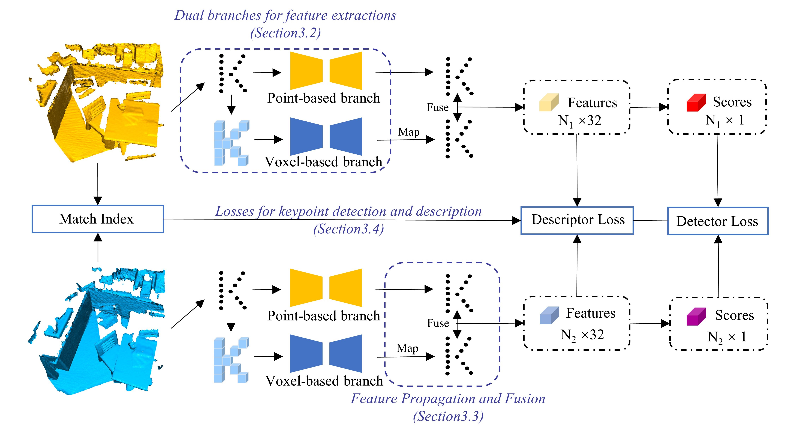

# V2PNet
Voxel to Point Propagation and Fusion to Improve Feature Representation for Point Cloud Registration

## Network Structure


## Requirements
Thus requirements need to be met:

- Ubuntu 14.04 or higher (Manjaro Linux 22.0.0 or higher)
- CUDA 11.1 or higher
- Python v3.7 or higher
- Pytorch v1.6 or higher
- MinkowskiEngine v0.5 or higher

Specifically, The code has been tested with:
Manjaro Linux 22.0.0, CUDA 11.3.1, python 3.8.12, Pytorch 1.10.12, GeForce RTX 3080Ti.

## Installation
### First, create the conda environment:
```shell script
conda env create -f v2pnet.yml -n v2pnet
conda activate v2pnet
```

### Second, install MinkowskiEngine for voxelization and devoxelization, here we offer two ways according to MinkowskiEngine by using the version we offered:
```shell script
cd MinkowskiEngine

# Install package openblas-devel
conda install openblas-devel -c anaconda

# Specify the file path according to the location of your cuda
export CUDA_HOME=/opt/cuda

# Install MinkowskiEngine
python setup.py install --blas_include_dirs=${CONDA_PREFIX}/include --blas=openblas
cd ..

# Or following official command installation by pypi:
pip install git+https://github.com/NVIDIA/MinkowskiEngine.git
```

### Thrid, install cpp_wrappers
```shell script
cd cpp_wrappers
sh compile_wrappers.sh
cd ..
```

## Dataset
- The datasets have been uploaded to Baidu Cloud.
- [3DMatch](https://pan.baidu.com/s/1VKR0y2ydxJWaz2oAVZAGqQ?pwd=9ant), Code: 9ant.
- [KITTI](https://pan.baidu.com/s/1HaOL99bW7hwfdNiHbsILmA?pwd=rd5p), Code: rd5p.

```
├── dataset
│   ├──	3dmatch  
        ├── 7-scenes-redkitchen
        ├── sun3d-hotel_uc-scan3
        ├── sun3d-hotel_umd-maryland_hotel1
        ├── sun3d-hotel_umd-maryland_hotel3
        ├── sun3d-home_at-home_at_scan1_2013_jan_1
        ├── sun3d-mit_76_studyroom-76-1studyroom2
        ├── sun3d-home_md-home_md_scan9_2012_sep_30
        └── sun3d-mit_lab_hj-lab_hj_tea_nov_2_2012_scan1_erika
│   ├── kitti
        ├── dataset
            ├── poses
            └── sequences     
        ├── icp
        └── scene_list       
```

## Pretrained model
We provide the pre-trained model of 3DMatch pretrained model and KITTI pretrained model in [ptrtrain_model](https://github.com/houyongkuo/V2PNet/tree/main/pretrain_model).

## Test
To test V2PNet, by command:
```shell script
# Indoor-scene dataset 3DMatch
python test_3dmatch.py
```
The `Registration Recall` can be calculated by running the `evaluate.m` in `geometric_registration/3dmatch` (if you install matlab engine, you can run `eva.py` in `geometric_registration/3dmatch/`) which are provided by [3DMatch.](https://github.com/andyzeng/3dmatch-toolbox/tree/master/evaluation/geometric-registration) You need to modify the `descriptorName` to `V2PNet_{timestr}` in the `geometric_registration/3dmatch/evaluate.m` file. You can change the number of keypoints in `evaluate.py`.

```shell script
# Outdoor-scene dataset KITTI
python test_kitti.py
```

## Discussion
Whether bias is added during the linear process in the training will have an effect on the results for reasons to be analyzed.

## Acknowledgment
We would like to thank the open-source code of [D3Feat](https://github.com/XuyangBai/D3Feat.pytorch), [FCGF](https://github.com/chrischoy/FCGF).

